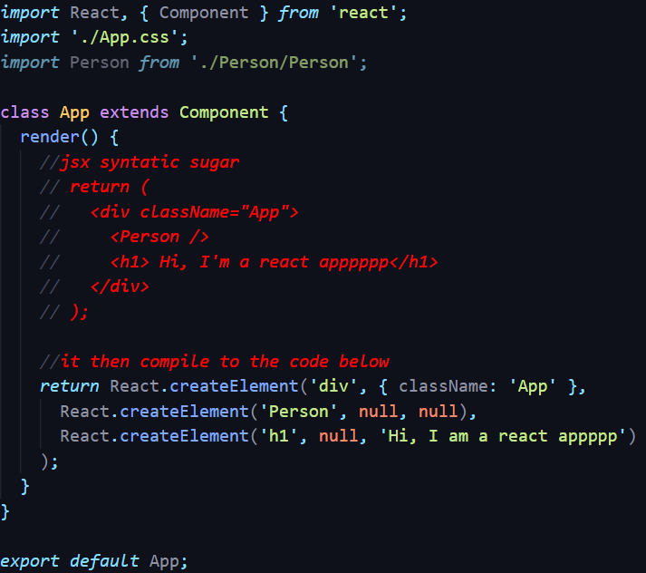
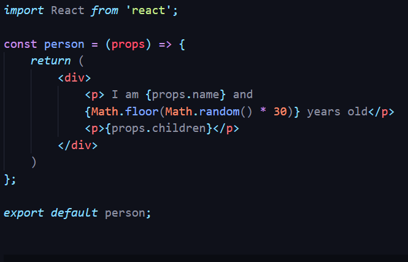
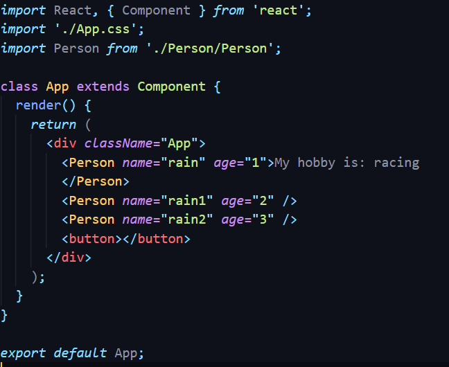
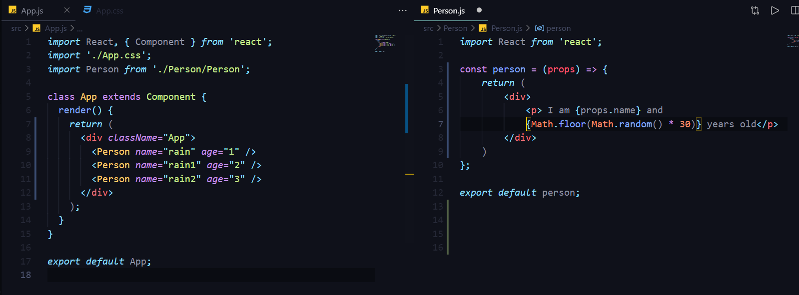
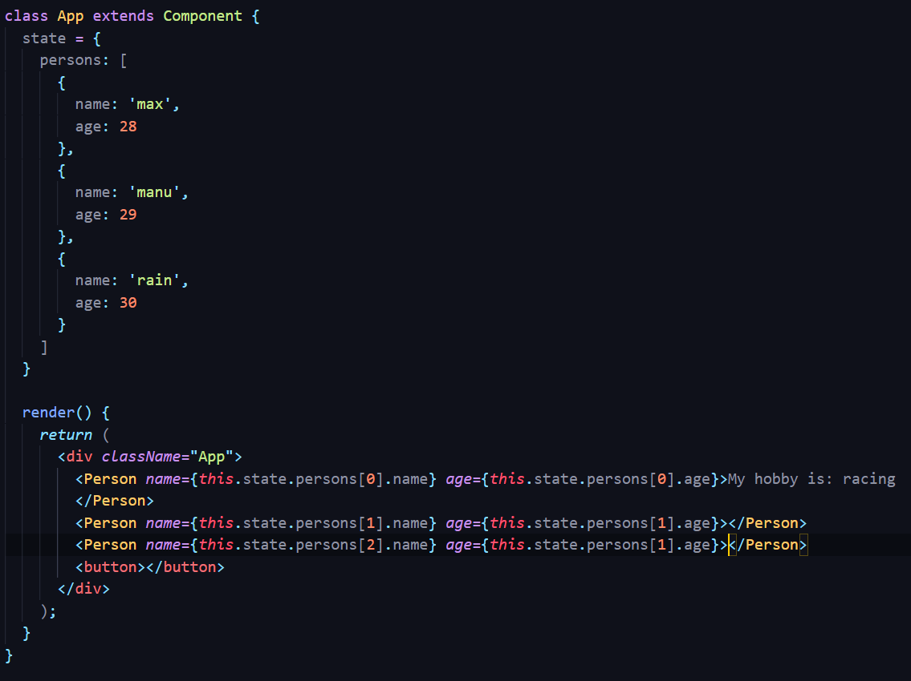
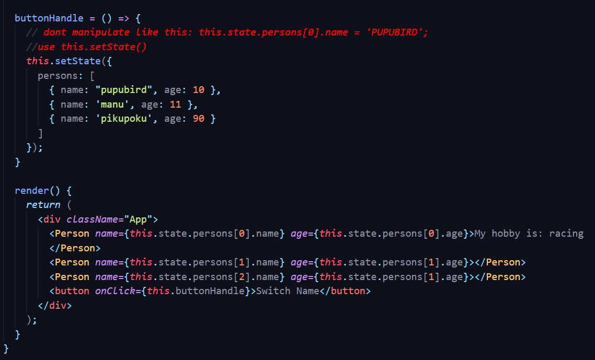
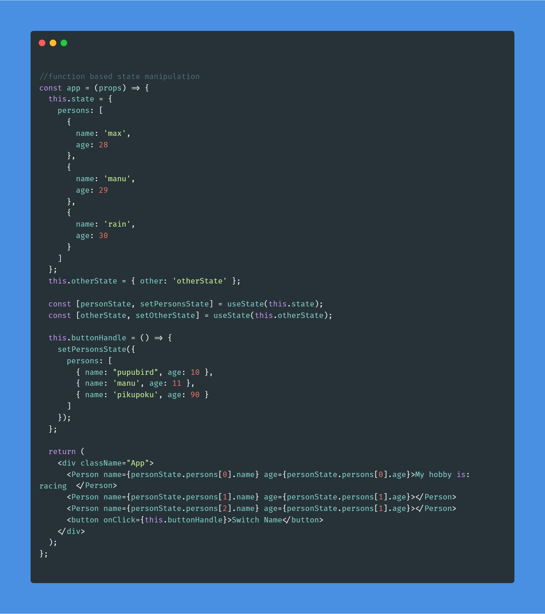
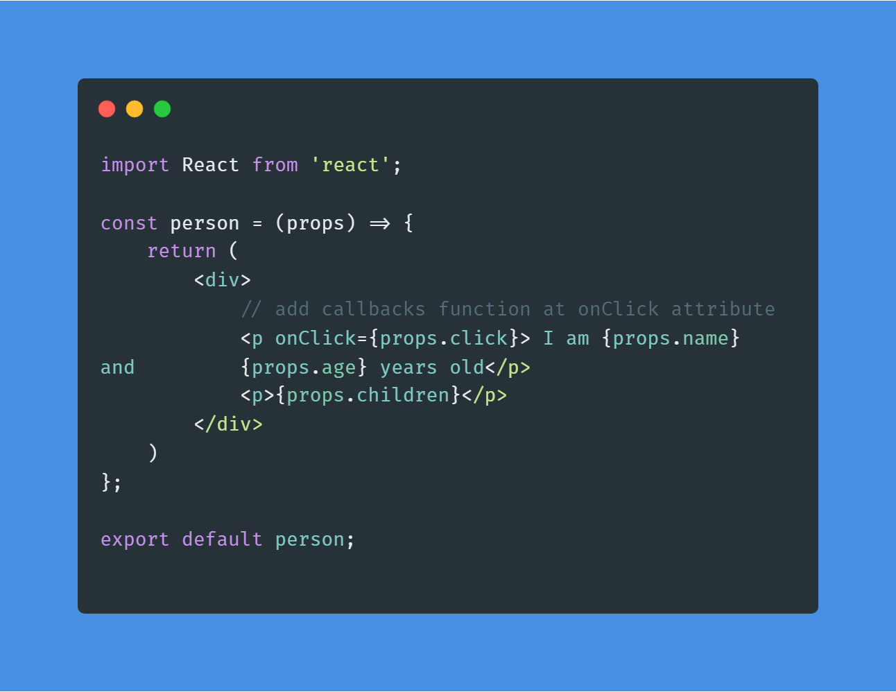
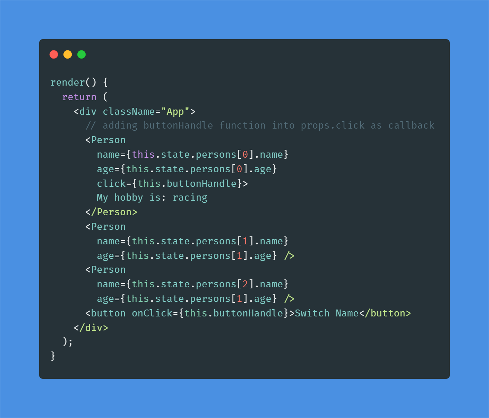
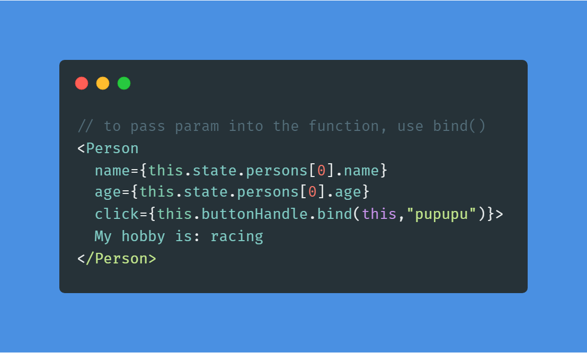

# REACTJS LEARN

A repo for recording the whole process of learning reactjs from an udemy course 
[React - The Complete Guide (incl Hooks, React Router, Redux](https://www.udemy.com/course/react-the-complete-guide-incl-redux/)
by Ivan Machuk
*4.7 (49,758 ratings)*
_159,748 students enrolled_

# Table of content

1. [Setup](#setup)
2. [Components & JSX](#Components-&-JSX)
3. [Props & state](#props&state)
4. [Event hander](#event-handler)
5. [State & Props Manipulation](#state-props-manipulation)
6. [Passing Method between Components & Binding](#pass-method-binding)

## Setup 

[Install create-react-app](https://github.com/facebook/create-react-app)

## Components & JSX 

Components are the core building block of React apps. Actually, React really is just a library for creating components in its core.

A typical React app therefore could be depicted as a component tree - having one root component ("App") and then an potentially infinite amount of nested child components.

Each component needs to return/ render some JSX code - it defines which HTML code React should render to the real DOM in the end.

JSX is NOT HTML but it looks a lot like it. Differences can be seen when looking closely though (for example className in JSX vs class in "normal HTML"). JSX is just syntactic sugar for JavaScript, allowing you to write HTMLish code instead of nested React.createElement(...) calls.

When creating components, you have the choice between two different ways:

Functional components (also referred to as "presentational", "dumb" or "stateless" components - more about this later in the course) => const cmp = () => { return `
`some JSX`
` } (using ES6 arrow functions as shown here is recommended but optional)

class-based components (also referred to as "containers", "smart" or "stateful" components) => class Cmp extends Component { render () { return `
`some JSX`
` } }  

## Props & State 

props  and state are CORE concepts of React. Actually, only changes in props  and/ or state  trigger React to re-render your components and potentially update the DOM in the browser.

### Props

props allow you to pass data from a parent (wrapping) component to a child (embedded) component.

Example:

Post Component:

    const post = (props) => {
        return (
            `
`
                `<h1>`{props.title}`</h1>`
            `
`
        );
    }

Here, title  is the custom property (prop ) set up on the custom Post  component. We basically replicate the default HTML attribute behavior we already know (e.g. `<input type="text">`  informs the browser about how to handle that input).

The Post  component receives the props  argument. You can of course name this argument whatever you want - it's your function definition, React doesn't care! But React will pass one argument to your component function => An object, which contains all properties you set up on `<Post ... />` .

{props.title}  then dynamically outputs the title  property of the props  object - which is available since we set the title  property inside AllPosts  component (see above).

### State

Whilst props allow you to pass data down the component tree (and hence trigger an UI update), state is used to change the component, well, state from within. Changes to state also trigger an UI update.

Example:

NewPost Component:

    class NewPost extends Component { // state can only be accessed in class-based components!
        state = {
            counter: 1
        };  
    
        render () { // Needs to be implemented in class-based components! Needs to return some JSX!
            return (
                
{this.state.counter}

            );
        }
    }
Here, the NewPost  component contains state . Only class-based components can define and use state . You can of course pass the state  down to functional components, but these then can't directly edit it.

state  simply is a property of the component class, you have to call it state  though - the name is not optional. You can then access it via this.state  in your class JSX code (which you return in the required render()  method).

Whenever state  changes (taught over the next lectures), the component will re-render and reflect the new state. The difference to props  is, that this happens within one and the same component - you don't receive new data (props ) from outside!

## Event Handler 

### To Which Events Can You Listen?

### Clipboard Events

Event names:

    onCopy onCut onPaste

Properties:

    DOMDataTransfer clipboardData

### Composition Events

Event names:

    onCompositionEnd onCompositionStart onCompositionUpdate

Properties:

    string data

### Keyboard Events

Event names:

    onKeyDown onKeyPress onKeyUp

Properties:

    boolean altKey
    number charCode
    boolean ctrlKey
    boolean getModifierState(key)
    string key
    number keyCode
    string locale
    number location
    boolean metaKey
    boolean repeat
    boolean shiftKey
    number which

### Focus Events

Event names:

    onFocus onBlur

These focus events work on all elements in the React DOM, not just form elements.

Properties:

    DOMEventTarget relatedTarget

### Form Events

Event names:

    onChange onInput onInvalid onSubmit

For more information about the onChange event, see Forms.

### Mouse Events

Event names:

    onClick onContextMenu onDoubleClick onDrag onDragEnd onDragEnter onDragExit
    onDragLeave onDragOver onDragStart onDrop onMouseDown onMouseEnter onMouseLeave
    onMouseMove onMouseOut onMouseOver onMouseUp

The onMouseEnter and onMouseLeave events propagate from the element being left to the one being entered instead of ordinary bubbling and do not have a capture phase.

Properties:

    boolean altKey
    number button
    number buttons
    number clientX
    number clientY
    boolean ctrlKey
    boolean getModifierState(key)
    boolean metaKey
    number pageX
    number pageY
    DOMEventTarget relatedTarget
    number screenX
    number screenY
    boolean shiftKey

### Selection Events

Event names:

    onSelect

### Touch Events

Event names:

    onTouchCancel onTouchEnd onTouchMove onTouchStart

Properties:

    boolean altKey
    DOMTouchList changedTouches
    boolean ctrlKey
    boolean getModifierState(key)
    boolean metaKey
    boolean shiftKey
    DOMTouchList targetTouches
    DOMTouchList touches

### UI Events

Event names:

    onScroll

Properties:

    number detail
    DOMAbstractView view

### Wheel Events

Event names:

    onWheel

Properties:

    number deltaMode
    number deltaX
    number deltaY
    number deltaZ

### Media Events

Event names:

    onAbort onCanPlay onCanPlayThrough onDurationChange onEmptied onEncrypted
    onEnded onError onLoadedData onLoadedMetadata onLoadStart onPause onPlay
    onPlaying onProgress onRateChange onSeeked onSeeking onStalled onSuspend
    onTimeUpdate onVolumeChange onWaiting

### Image Events

Event names:

    onLoad onError

### Animation Events

Event names:

    onAnimationStart onAnimationEnd onAnimationIteration

Properties:

    string animationName
    string pseudoElement
    float elapsedTime

### Transition Events

Event names:

    onTransitionEnd

Properties:

    string propertyName
    string pseudoElement
    float elapsedTime

### Other Events

Event names:

    onToggle

## State & Props Manipulation 

Based on [Understanding ReactJS — setState](https://medium.com/@baphemot/understanding-reactjs-setstate-a4640451865b) by Bartosz Szczeciński:

    ...While it is technically possible to alter state by writing to this.state directly, 
    it will not lead to the Component re-rendering with new data, 
    and generally lead to state inconsistency.

Hence, we shall be using this.setState() instead of directly manipulate the state data.

Class-based State Manipulation:

Function-based State Manipulation:

in function based manipulation, there is no setState() function, hence we will need to import useState (a react hook function) to replace it.

    useState() return a list [state, setState].

## Passing Method between Components & Binding 

To pass a callback function between components:

First calling it using props.[method name]

Secondly add it in the origin file

To pass param together with the callbacks, use bind()

