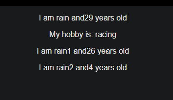

# REACTJS LEARN

A repo for recording the whole process of learning reactjs from an udemy course 
[React - The Complete Guide (incl Hooks, React Router, Redux](https://www.udemy.com/course/react-the-complete-guide-incl-redux/)
by Ivan Machuk
*4.7 (49,758 ratings)*
_159,748 students enrolled_

# Table of content

1. [Setup](#setup)
2. [Components & JSX](#Components-&-JSX)
3. [Props & state](#props&state)

## Setup 

[Install create-react-app](https://github.com/facebook/create-react-app)

## Components & JSX 

Components are the core building block of React apps. Actually, React really is just a library for creating components in its core.

A typical React app therefore could be depicted as a component tree - having one root component ("App") and then an potentially infinite amount of nested child components.

Each component needs to return/ render some JSX code - it defines which HTML code React should render to the real DOM in the end.

JSX is NOT HTML but it looks a lot like it. Differences can be seen when looking closely though (for example className in JSX vs class in "normal HTML"). JSX is just syntactic sugar for JavaScript, allowing you to write HTMLish code instead of nested React.createElement(...) calls.

When creating components, you have the choice between two different ways:

Functional components (also referred to as "presentational", "dumb" or "stateless" components - more about this later in the course) => const cmp = () => { return `
`some JSX`
` } (using ES6 arrow functions as shown here is recommended but optional)

class-based components (also referred to as "containers", "smart" or "stateful" components) => class Cmp extends Component { render () { return `
`some JSX`
` } }  

## Props & State 

props  and state are CORE concepts of React. Actually, only changes in props  and/ or state  trigger React to re-render your components and potentially update the DOM in the browser.

### Props

props allow you to pass data from a parent (wrapping) component to a child (embedded) component.

Example:

Here, title  is the custom property (prop ) set up on the custom Post  component. We basically replicate the default HTML attribute behavior we already know (e.g. `<input type="text">`  informs the browser about how to handle that input).

Post Component:

    const post = (props) => {
        return (
            `
`
                `<h1>`{props.title}`</h1>`
            `
`
        );
    }

The Post  component receives the props  argument. You can of course name this argument whatever you want - it's your function definition, React doesn't care! But React will pass one argument to your component function => An object, which contains all properties you set up on `<Post ... />` .

{props.title}  then dynamically outputs the title  property of the props  object - which is available since we set the title  property inside AllPosts  component (see above).

### State

Whilst props allow you to pass data down the component tree (and hence trigger an UI update), state is used to change the component, well, state from within. Changes to state also trigger an UI update.

Example:

NewPost Component:

    class NewPost extends Component { // state can only be accessed in class-based components!
        state = {
            counter: 1
        };  
    
        render () { // Needs to be implemented in class-based components! Needs to return some JSX!
            return (
                
{this.state.counter}

            );
        }
    }
Here, the NewPost  component contains state . Only class-based components can define and use state . You can of course pass the state  down to functional components, but these then can't directly edit it.

state  simply is a property of the component class, you have to call it state  though - the name is not optional. You can then access it via this.state  in your class JSX code (which you return in the required render()  method).

Whenever state  changes (taught over the next lectures), the component will re-render and reflect the new state. The difference to props  is, that this happens within one and the same component - you don't receive new data (props ) from outside!
