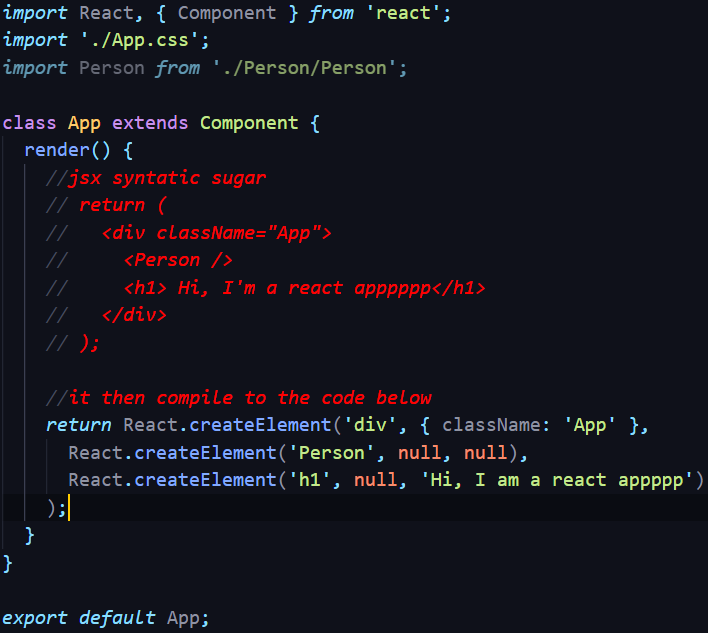

# REACTJS LEARN

A repo for recording the whole process of learning reactjs from an udemy course 
[React - The Complete Guide (incl Hooks, React Router, Redux](https://www.udemy.com/course/react-the-complete-guide-incl-redux/)
by Ivan Machuk
*4.7 (49,758 ratings)*
_159,748 students enrolled_

# Table of content

1. [Setup](#setup)
2. [Components & JSX](#Components-&-JSX)

## Setup 

[Install create-react-app](https://github.com/facebook/create-react-app)

## Components & JSX 

Components are the core building block of React apps. Actually, React really is just a library for creating components in its core.

A typical React app therefore could be depicted as a component tree - having one root component ("App") and then an potentially infinite amount of nested child components.

Each component needs to return/ render some JSX code - it defines which HTML code React should render to the real DOM in the end.

JSX is NOT HTML but it looks a lot like it. Differences can be seen when looking closely though (for example className in JSX vs class in "normal HTML"). JSX is just syntactic sugar for JavaScript, allowing you to write HTMLish code instead of nested React.createElement(...) calls.

When creating components, you have the choice between two different ways:

Functional components (also referred to as "presentational", "dumb" or "stateless" components - more about this later in the course) => const cmp = () => { return `
`some JSX`
` } (using ES6 arrow functions as shown here is recommended but optional)

class-based components (also referred to as "containers", "smart" or "stateful" components) => class Cmp extends Component { render () { return `
`some JSX`
` } }  
